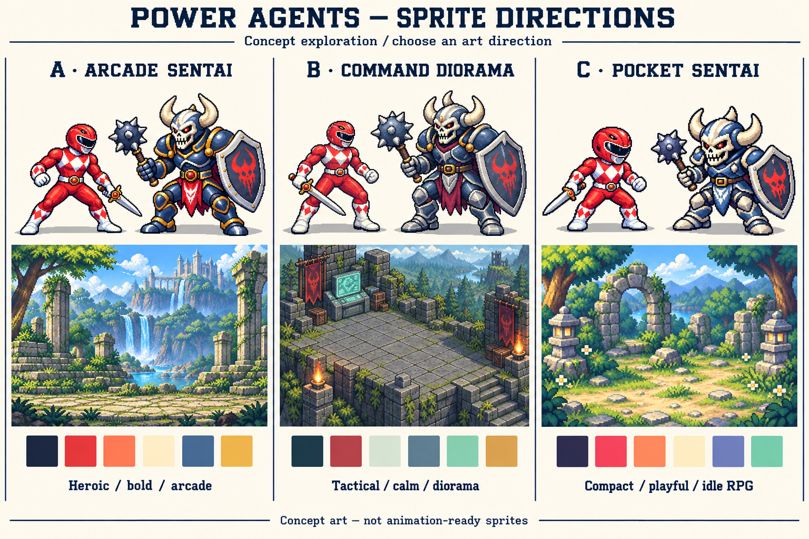

# Power Agents — sprite direction exploration

Stage 1 only. Generated with the built-in image-generation tool from the supplied Ranger reference and the living-workspace concept. Application code and behavior were not changed. These are concept samples, not animation-ready sprites.

## Comparison

The comparison board is a generated presentation; it recomposes the samples and is not an exact sprite atlas. The individual transparent PNGs below are the source concepts. In particular, the board slightly changes some body proportions and removes the actors from the environment thumbnails; the standalone vignettes show the actual proposed world scale.

| Direction | Character / monster / scene | Visual rules | Readability | Animation complexity | Product fit |
|---|---|---|---|---|---|
| A — Arcade Sentai | [Ranger](a-arcade-sentai/ranger.png) · [Monster](a-arcade-sentai/monster.png) · [Scene](a-arcade-sentai/scene.png) | Tall heroic figures, strong dark outline, saturated red, ivory and gold, horizontal encounter lane | Strong action silhouette; small costume details need simplification at small sizes | Medium-high: longer limbs and wider sword arcs need more controlled poses | Closest to the supplied battle reference; strong mission/encounter view |
| B — Command Diorama | [Ranger](b-command-diorama/ranger.png) · [Monster](b-command-diorama/monster.png) · [Scene](b-command-diorama/scene.png) | Sturdy figures, slate/burgundy/mint accents, restrained background, elevated three-quarter stage | Clear spatial grouping and room for labels; fine armor texture needs reduction | High if characters move freely around the diorama; moderate if each has fixed facing and stations | Best foundation for a daily team workspace with planning, work, waiting and review areas |
| C — Pocket Sentai | [Ranger](c-pocket-sentai/ranger.png) · [Monster](c-pocket-sentai/monster.png) · [Scene](c-pocket-sentai/scene.png) | Large helmets, short limbs, chunky purple-dark outline, warm highlights, compact shrine setting | Strongest identity at small sizes; less room for costume variation | Low-medium: compact body motion and a few expressive key poses | Best for a dense roster, narrow browser panels and a playful idle-RPG feel |

## Recommended direction

**B — Command Diorama** is the strongest product foundation: its elevated stage supports several agents and task groups while leaving space for status markers and operational panels. Borrowing A's stronger red/white contrast is a useful optional refinement. If the priority is matching the battle reference as closely as possible, choose A instead. A hybrid needs one unified camera and pixel grid; existing sprites from different directions should not simply be mixed.

## Proposed production sizing — to confirm after selection

These are future target frame canvases, not the current PNG export dimensions. Current character exports are 1254 × 1254 RGBA; scenes and board are 1536 × 1024 RGB. The generated artwork is not guaranteed to use a uniform logical pixel grid.

| Direction | Ranger frame | Monster frame | Suggested display | Camera | Idle pilot |
|---|---|---|---|---|---|
| A | 128 × 128 logical px | 160 × 160 | 2× integer scaling: 256 / 320 px | Side-on three-quarter arcade view | 4-frame breathing loop, fixed feet and sword grip, 1 px shoulder lift |
| B | 96 × 96 logical px | 128 × 128 | 2×: 192 / 256 px | Elevated three-quarter orthographic view | 4-frame weight shift with planted feet; small visor-light change |
| C | 64 × 64 logical px | 96 × 96 | 2×: 128 / 192 px; 3× in a larger arena | Slightly elevated three-quarter RPG view | 4-frame 1 px body bob and gentle helmet tilt |

The frame is not the actor's body height: reserve internal space for weapons and motion, and normalize the monster's actual height to about 1.2× the Ranger. Idle loops should be slow, roughly 1.2–1.8 seconds per loop. Exact frames, timing and pivots belong to the selected-style pilot; no animation sheets have been generated yet.

## Palettes

Proposed palette anchors, not a claim that the generated images contain only these six colors. The final set needs deliberate shade ramps and color reduction.

- **A:** ink `#172033`, crimson `#D93438`, hot highlight `#FF7157`, ivory `#FFF1D2`, steel `#376586`, gold `#EAB64E`.
- **B:** deep slate `#192C32`, burgundy `#AF3544`, pale neutral `#D9E7D8`, steel `#52717A`, mint `#8CC6B4`, amber `#D0A558`.
- **C:** dark violet `#28243F`, coral-red `#EC4055`, peach `#FF926B`, cream `#FFF0C9`, periwinkle `#666AB0`, mint `#75CBB1`.

## Extending each style to agent states

These are proposed event-driven motions, not implemented or validated animations.

| State | A — Arcade | B — Diorama | C — Pocket |
|---|---|---|---|
| Idle | Slow shoulder breathing, planted feet | Small weight shift at assigned station | Helmet tilt and gentle bob |
| Planning | Ranger faces mission beacon | Ranger gathers at mission terminal | Ranger examines a small mission card |
| Working | Short controlled strike on task activity | Compact tool/weapon action at task station | One clear compact action and small impact effect |
| Messaging | Hand-to-helmet communicator gesture | Brief signal between team stations | Small speech bubble and helmet turn |
| Waiting for a colleague | Lowered weapon and visible waiting marker | Turn toward colleague, pause at handoff point | Seated/resting pose and waiting icon |
| Blocked | Shield/obstacle marker, reason in UI | Locked task marker with readable reason | Stop marker, no repeated attack |
| Reviewing | Visor scan across result document | Inspect a document at review station | Magnifier/document pose |
| Completed | Short salute then settle | Check signal, return to ready station | Brief fist pump then idle |
| Paused / error | Freeze working action; explicit status | Inactive station; explicit status | Stop bob; distinct pause/error badge |

Animation intensity is cosmetic. Attacks never imply measured percentage completion or real external execution. Use real task states and confirmed milestones; reduced-motion mode uses static poses plus text/icons. Colors identify participants, not permanent jobs or providers.

## Inspection and production cleanup

- All six character PNGs are RGBA and contain genuinely transparent pixels. No painted checkerboard is used.
- Visible silhouettes (alpha ≥ 128) fit within the canvas. No visible feet, horns, swords or maces are clipped.
- Alpha inspection found low-alpha speckles extending into some canvas margins. Most interior pixels have alpha around 253/255 rather than completely opaque 255. Clean these and normalize alpha deliberately for production.
- The images use pixel-art styling, but are not verified as a uniform grid of logical pixels. Redraw/reduce onto the selected grid before sprite-sheet assembly.
- Sword hand/placement varies between directions; shield outlines are angular rather than the originally suggested round shield. Standardize weapon hand, shield shape, emblem, belt and costume details in the chosen direction.
- B's standalone sprites are less elevated than its environment camera. Redraw the selected poses to one camera before treating the kit as production-ready.
- Environment renders alter some relative character scales and proportions. Use the proposed production scale and shared foot pivots, not screenshot dimensions, for the pilot.
- Backgrounds are more detailed than final small workspace scenes should be. Reduce contrast and detail behind status labels.
- No animation, loop continuity, packed atlas, frame metadata or application rendering has been verified. Exact target-size readability remains a selected-direction pilot check.

## Files

- `comparison-board.png`: labelled overview.
- `a-arcade-sentai/`, `b-command-diorama/`, `c-pocket-sentai/`: each contains `ranger.png`, `monster.png`, `scene.png`.
- `generation-prompts.json`: exact prompt set, original generated paths and copied deliverable paths.
- `asset-checks.json`: dimensions, alpha counts and nonzero-alpha bounds from read-only image inspection. Low-opacity margin pixels are included in those bounds.

Choose A, B, C, or a specific combination before generating the roster, effects or animation sheets. Implementation follows a separate request.
