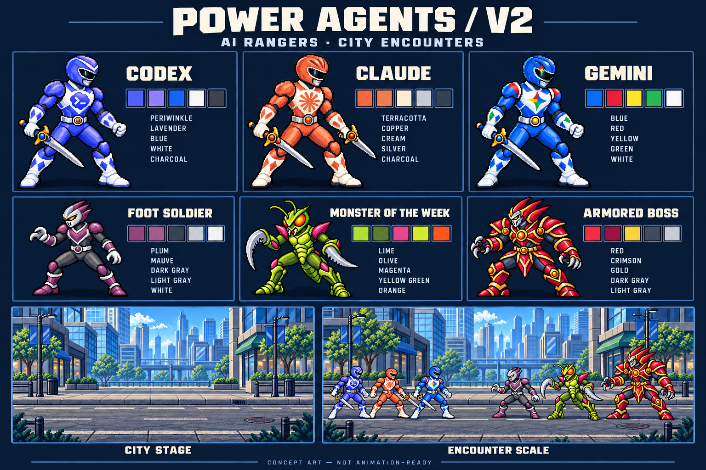

# Power Agents — V2 AI Rangers / City
Date: 2026-10-07
Status: **Generated concept assets for approval. Not production sprites or animation sheets.**

## Deliverables
- [Codex Ranger](codex-ranger.png), [Claude Ranger](claude-ranger.png), [Gemini Ranger](gemini-ranger.png)
- [Foot soldier](villain-foot-soldier.png), [Volt Mantis monster](villain-monster.png), [Crimson Overlord boss](villain-boss.png)
- [Empty city background](city-background.png)
- [Encounter composition](encounter.png)
- [Labelled review board](review-board.png)
- [Exact generation prompts and reference paths](generation-prompts.json)
- [Image metadata and alpha measurements](asset-checks.json)

The nine primary images are in this directory. `studies/encounter-study.png` is an intermediate four-character composition, retained for provenance. Previous exploration assets are preserved. No app code or behavior changed.

## Branding references and interpretation
### Codex
The current installed official OpenAI application contains `/Applications/ChatGPT.app/Contents/Resources/icon-codex-light.png`. It was visually inspected and copied unchanged to `references/codex-icon.png`: a blue-to-lavender scalloped badge containing a white terminal `>_` symbol.
[OpenAI's desktop migration documentation](https://help.openai.com/en/articles/20001276-moving-to-the-new-chatgpt-desktop-app) confirms the Codex icon remains selectable. [Official product page](https://openai.com/codex/).

Costume interpretation: periwinkle armor, lavender highlights, white-silver trim, the terminal badge on the chest, chevron brow. This is an interpretation of the actual product icon, not a claimed official apparel palette. No generic OpenAI-green substitution.

### Claude
[Official Claude site](https://claude.com/) uses an irregular orange radial starburst; its live header SVG was inspected and uses #D97757. The official desktop icon was also visually inspected and copied unchanged to `references/claude-icon.png`. [Anthropic press kit](https://anthropic.com/press-kit).

Costume interpretation: terracotta armor, copper shadows, cream panels, a large orange starburst chest emblem, and fan-like helmet detailing. Cream and metallic shades are artistic costume choices.

### Gemini
[Official Gemini site](https://gemini.google/about/) shows a four-color spark. [Google's announcement](https://blog.google/company-news/inside-google/company-announcements/gradient-g-logo-design/) confirms the Gemini spark received the four-color gradient update in June 2025. Live header SVG geometry/fills were inspected: red top, yellow left, green bottom, blue right. Observed fills include #FC413D, #FFE432 / #FBBC04, #00B95C, #3186FF. [Official monochrome geometry reference](https://storage.googleapis.com/gweb-gemini-cdn/gemini/uploads/c546a20243c57b297546630cf76e417a2483acb8.svg).

Costume interpretation: dominant blue armor, small red/yellow/green accents, four-color chest spark, white trim. Hard color steps replace the logo gradient to suit pixel art. These are not exact exported brand marks.

Provider identity remains stable; roles remain dynamic. Team placement and equipment do not assign leadership or specialties.

## Shared visual rules
- Keep Option B's sturdy Ranger proportions, broad shoulder shells, domed helmet, dark visor, silver mouth plate, gloves, high boots and belt construction.
- Reproject into Option A's side-on, slightly three-quarter arcade viewpoint. Upright camera, horizontal shared ground lane; minimal visible top surfaces.
- Rangers face right; enemies face left. Upper-left daylight; dark outlines and stepped material shading.
- One dominant chest mark per Ranger, restrained secondary costume motifs.
- Enemy family: repeatable masked grunt, rubber-suit insect monster, flamboyant science-fiction armored boss. No provider branding on enemies.
- Modern city street with skyline and a clear encounter lane. No elevated platform or fantasy ruins.
- Final production should separate actors, shadows, effects, UI labels and scenery. This pack has separate actors and background; no effect or shadow assets were requested/generated.

## Proposed logical dimensions (not yet exported)
All generated actor files are 1254×1254 RGBA. Scene and board files are 1536×1024 RGB. Source canvas sizes do **not** imply a uniform logical pixel grid.

| Asset | Proposed frame | Approx. silhouette height | Default display |
|---|---:|---:|---:|
| Ranger | 128×128 | 96 px | 2×; 192 px tall actor |
| Foot soldier | 128×128 | 91 px | 2×; 182 px tall actor |
| Monster | 160×160 | 110 px including antennae | 2×; 220 px tall actor |
| Boss | 192×192 | 134 px including fins | 2×; 268 px tall actor |
| City | 768×512 concept target | — | 2×; crop responsively after implementation approval |

Relative heights: Ranger 1.00, soldier ~0.95, monster ~1.15, boss ~1.40. Widths must leave room for weapon arcs and appendages.
Proposed pivot: horizontal center of the stance at ground contact, measured consistently in every frame, with soles on a defined baseline 8 logical pixels above frame bottom. Record pivot metadata per frame; do not bottom-align raw generated canvases. Equipment is included in frame bounds but must not determine the stance pivot.
These dimensions, exact palettes and exports remain proposals for the next approved production stage.

## Inspection and remaining cleanup
All nine images were visually inspected. The metadata check in `asset-checks.json` confirms genuine zero-alpha backgrounds on all six isolated actors; no checkerboard backdrop was baked in.
- Complete visible silhouettes, blades, antennae and fins remain inside their canvases. Boss padding is particularly tight at the top/bottom and should be expanded during production.
- Low-alpha stray pixels extend to canvas edges in several assets. Most nonzero actor alpha is near-opaque rather than exactly 255. Clean alpha and opaque interiors need a precision pass before export.
- The three Ranger silhouettes/armor share a clear family. Codex and Gemini remain close in hue; their chest marks, lavender vs cobalt highlights and Gemini's accent colors distinguish them. Consider increasing the hue separation after approval.
- Product marks are recognizable concept approximations. Codex's scallop geometry, Claude's rays and Gemini's curved four-point geometry need precise hand-controlled pixel redraws.
- Gemini repeats the spark on the helmet; simplify this if it competes with the primary chest mark.
- Pixel density is not mathematically uniform. Generated edges and some shading use smaller steps/softening. Redraw or normalize onto the agreed logical grid; simple downscaling alone will not guarantee clean pixels.
- Viewpoint generally reads as a horizontal arcade encounter, but boots and pauldrons retain mild top-surface/camera drift. Standardize during sprite production.
- Character silhouettes and major insignia remain readable at their roughly 240px Ranger height in the full encounter. Detailed logo geometry will need a separate check at the proposed 192px browser actor height.
- The composite scene and board are regenerated illustrations, not exact pixel copies of the isolated files. Armor, sword placements and silhouette details drift; the review board gives Claude an extra/altered sword. **Use individual PNGs as design references**, not board samples as export sources.
- City texture is still busier than an eventual operational workspace may need. Tone down road texture/window contrast behind status labels during the next design pass.
- The villain mask family is intentionally similar. Boss reads through scale, horns, shoulder mass and red-gold palette.
- No frame alignment, animation loops, hitboxes, parallax separation or in-app rendering has been validated.

## Next approval
Approve or correct the Ranger branding, costume shapes, city treatment and villain family. After approval, establish exact palette ramps, dimensions, baseline/pivot metadata and export naming, then validate a pilot idle sequence before expanding animations. Application implementation requires a separate request.
