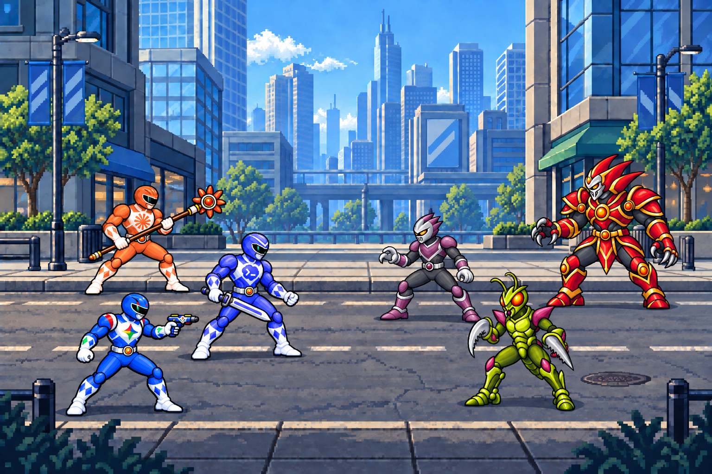
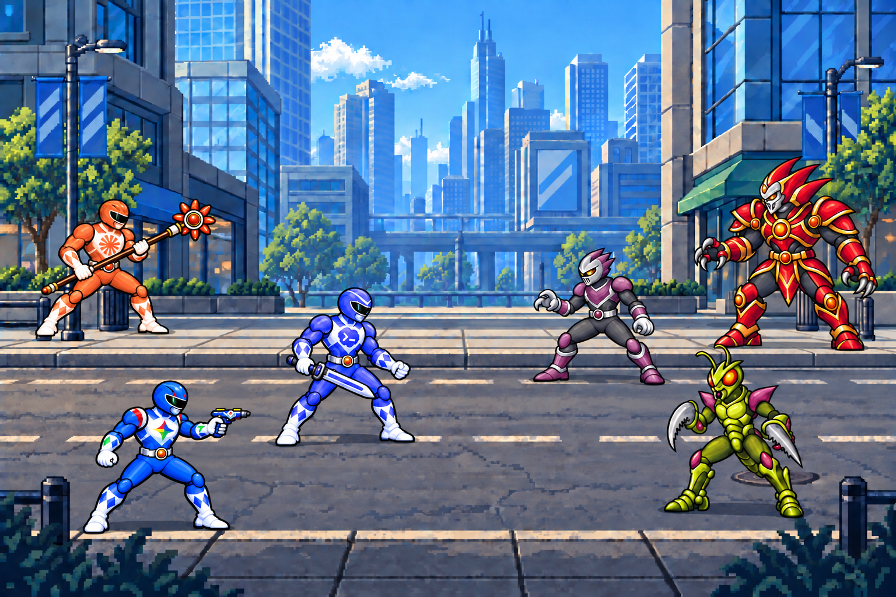

# Power Agents V3 — Weapons and formations

**Status: visual concepts for approval.** Generated with the built-in image-generation tool. No application changes or animations. V2 is preserved.

## Review
Open [review.html](review.html) for the three weapons at approximately 190px character height and labelled A/B previews. Labels are outside the artwork.

### A — Clear triangular squad (recommended)

Two Rangers occupy rear near/far lanes, with Codex at the forward tip. The squad reads as a connected group and retains a clear central encounter gap. This placement has no permanent leadership or job meaning.

### B — Loose stagger

The same team spreads across more of the stage, with more space near Claude's staff and between the opposition. It offers more room for future status labels, but feels less cohesive and emphasizes the sidewalk-versus-road depth.

## Revised characters
| Agent | Asset | Visual rationale |
|---|---|---|
| Codex | [Saber PNG](codex-saber.png) | Compact technical silver blade, lavender inset, squared dark hilt; shorter angular silhouette. |
| Claude | [Staff PNG](claude-staff.png) | Copper shaft, cream grip collars, starburst head; long diagonal silhouette with two-handed grip. |
| Gemini | [Blaster PNG](gemini-blaster.png) | Short cobalt/white sidearm with multicolor detail; compact silhouette distinct from both melee weapons. |

Each isolated Ranger carries exactly one intended weapon, with two arms and two legs. This equipment is a visual proposal, not a fixed provider role.

## Inspection
- Inspected all original references and generated outputs visually, including correction passes.
- All three final character PNGs are 1254×1254 RGBA with genuine zero-alpha backgrounds. Both encounter PNGs are 1536×1024 RGB.
- Visible silhouettes at alpha >=128 are completely inside the canvases; no clipped weapon tips, feet or limbs. Claude's staff has only 36 source pixels of right padding, so add margin when creating aligned production frames.
- Both final scenes retain saber, staff and blaster; earlier failed edits are excluded from the final image set.
- Formations have distinct foot depths, no straight-line squad, and maintain the side-on slightly three-quarter arcade camera.
- Chest identities remain recognizable. Claude's grip reads as two hands around one shaft. Gemini's low-ready blaster partly approaches the bottom of the chest emblem in the isolated concept; tighten that separation in production.
- All major silhouettes and weapons are readable in the encounter previews. Exact ~192px standalone browser-size inspection was not completed: the browser security policy blocked opening the local HTML review file. The review page is included for manual viewing; do not treat it as verified in-app rendering.
- Opponents retain the recognizable plum soldier, lime/magenta mantis and red/gold boss designs. They were referenced from V2 and repositioned, not exported as new isolated villains.

## Remaining cleanup
1. Near-invisible alpha speckles remain. Most nonzero alpha is 253 rather than exactly255. Normalize opaque interiors and clean edge specks during production.
2. Pixel grids, palette ramps and edge sharpness are not mathematically uniform. No production sprite dimensions or pivots have been applied.
3. Composite generation changes some anatomy/armor contours and weapon geometry: Gemini extends the pistol arm in scenes, Claude's staff head is simplified, Codex's blade is shorter. The isolated PNGs remain the weapon/design references.
4. Scene placement is approximate, not an exact sprite layout. Sidewalk/road contact, grounding shadows and depth occlusion need deterministic positioning during eventual implementation. Background texture also drifts slightly across generation passes.
5. Small weapon logos and original provider emblems require a precise pixel-art pass.
6. No animation alignment, loops, responsive app layout or frame exports have been validated.

## Files and provenance
- Five final PNGs in this folder.
- [Exact prompts, reference paths, generation history and final mapping](generation-prompts.json).
- [Alpha and dimension measurements](asset-checks.json).
- [Original approved V2 direction and branding references](../v2-ai-rangers-city/README.md).
- Intermediate generation paths are recorded in the manifest; they are not included as deliverables.
- This revision changes visual exploration assets only.

## Approval
Choose formation A or B, and approve or adjust the saber / staff / blaster mapping. Wait for that selection before animations, additional characters or application implementation.
