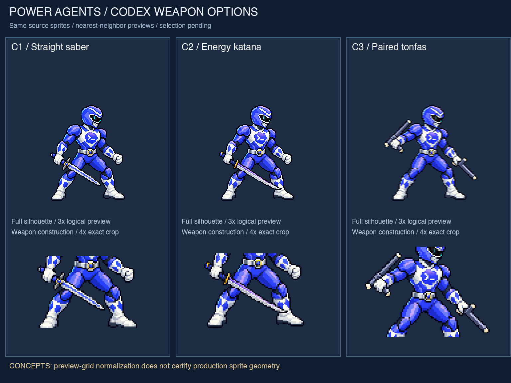
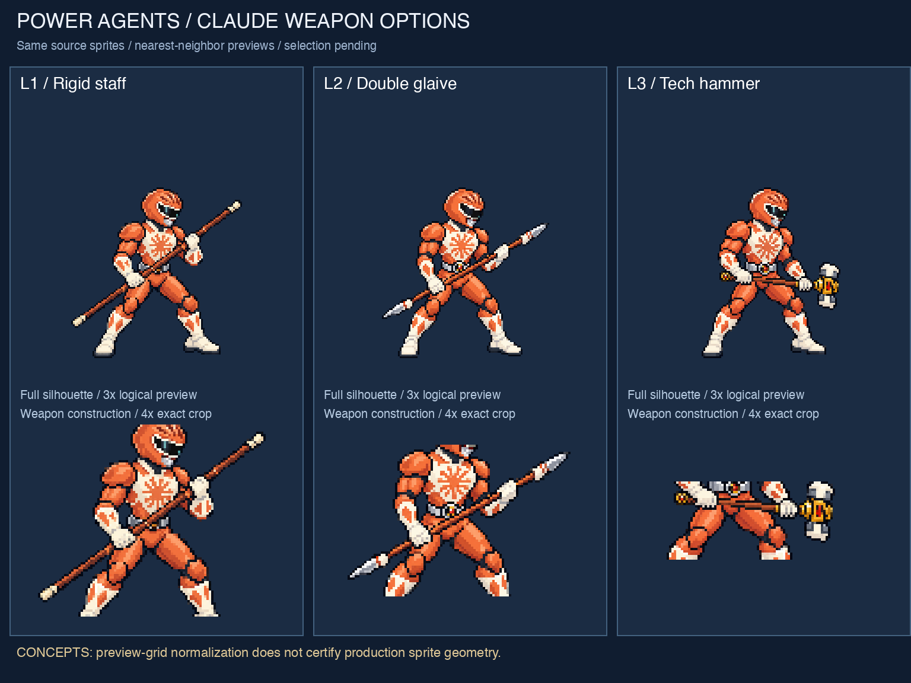
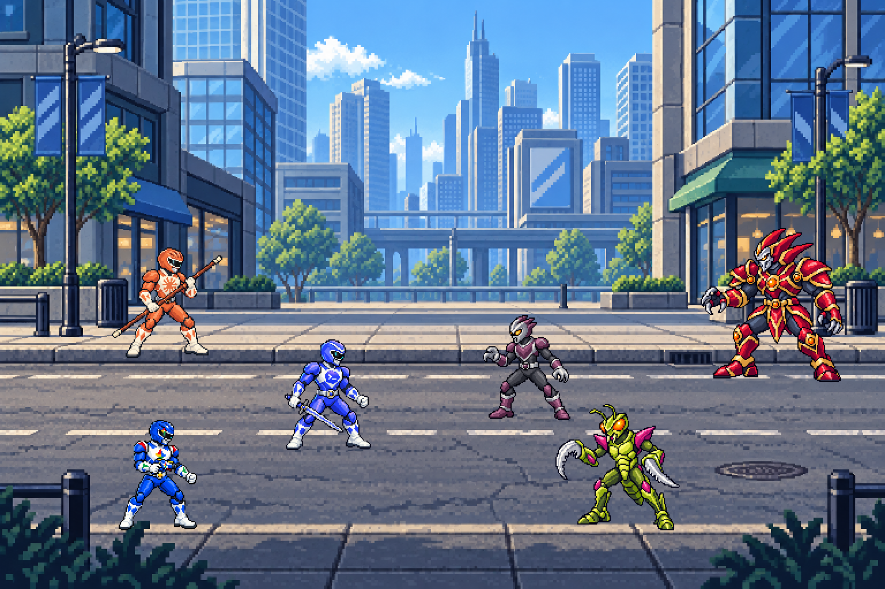

# Power Agents V4 — Weapon exploration
Date: 2026-10-08
Status: **Concepts for selection; no animation or app implementation.**

## Options
### Codex

- **C1 — Straight saber:** narrow centered blade and compact guard. Recommended: the simplest readable geometry, with a clearer taper than v3.
- **C2 — Energy katana:** longer, deliberately curved single-edge profile. More graceful, but the tip crosses the shin in this pose and needs more clearance in animation.
- **C3 — Paired tonfas:** distinct compact blunt-weapon silhouette. The two grips and apparent lengths still need a symmetry/perspective precision pass.

### Claude

- **L1 — Rigid staff:** straight shaft with simple matching end caps. Recommended: removes the decorative head and makes continuity through the grips easy to inspect.
- **L2 — Double glaive:** matching short pointed tips add a stronger combat silhouette. Tip geometry is visually similar, not numerically certified symmetric.
- **L3 — Tech hammer:** compact two-faced head, waist-level grip and a shorter silhouette. The generated gold collar is more ornate than requested; a production redraw should simplify it.

Six original generated PNGs have filenames starting C1–C3 / L1–L3 (lowercase on disk). They are separate RGBA images with genuine transparent backgrounds and no labels.

## Provisional scene

This uses **C1 + L1 provisionally**, Gemini's v3 blaster, the v2 villains and city. It does not approve a weapon pair or formation.

The scene and boards were assembled deterministically from the generated files with Pillow, following the requested preference for actual-asset assembly and nearest-neighbor previews. No generative repaint was used for the boards or scene. The exact derived preview frames are in `preview-frames/`.

## Working grid and transformations
- Proposed character frame: 160×160 logical pixels; Ranger silhouette: 96px high.
- Proposed display: 2× nearest-neighbor; Ranger silhouette: 192px high.
- All six original generated PNGs: 1254×1254. These remain unchanged.
- Preview derivation: alpha threshold128, crop visible bounds, nearest-neighbor resize to96px silhouette height, position by an estimated stance midpoint at baseline144 inside160×160.
- Preview alpha cleanup affects derived frames only. Original alpha speckles and near-opaque interiors remain available in the originals.
- Villains use91px soldier /110px monster /134px boss silhouette heights.
- City and encounter logical canvas:768×512; encounter output:1536×1024, exactly2× nearest-neighbor.
- Board main samples use3× logical frames; weapon details are exact4× crops of the same preview data. Context from the body is retained in the crops rather than inventing isolated weapon geometry.
- Labels use presentation typography outside the asset imagery; they are not proposed in-game typography.

**Verified:** the final scene is exact2× block replication of its logical canvas. This checks the preview's scaling, not the quality of the original pixel construction. Nearest-neighbor reduction is not a substitute for deliberate pixel cleanup or a proof of a hand-aligned production grid.

## Inspection and limitations
Inspected all six originals, both boards, the composed scene, all six at96px native and192px display height, and an8× C1 blade detail.

- Weapons remain complete inside source canvases. Two arms and two legs per Ranger; one loadout per option, with exactly two intentional tonfas for C3.
- C1's blade has a straighter axis and narrower taper than v3. C2's curvature is intentional. Claude's straight shafts read as continuous through their grips; no decorative flower head remains.
- Original transparent backgrounds contain alpha0. Many occupied pixels remain alpha253, with low-alpha edge noise. Numeric data is in `asset-checks.json`.
- The preview frames have binary alpha, complete silhouettes and consistent foot baselines. Their pivots are approximate, not animation-verified.
- Major colors and weapon silhouettes remain readable at192px height. The Claude starburst and Codex badge lose precision at96px native size; nearest-neighbor reduction creates noisy highlights and logo clusters.
- L1's diagonal staff crosses part of the lower chest motif; the provider identity remains readable, but a final pose should lower the grip slightly.
- C3's apparent baton lengths and L2's two blade tips require controlled geometry checks/redraws. Do not treat the generation as dimensionally exact.
- Scene actors use the exact normalized frames used by the boards. Weapons, grips and emblems are not repainted during assembly.
- Background texture density remains richer than the small characters. The shared canvas prevents interpolation drift but does not fully resolve texture/palette density differences.
- Contact shadows are not supplied. Ground placement is a style study; production needs verified stance pivots and grounding.
- Uniform palette ramps, hand-designed clusters, animation loops, responsive app behavior and production sprite exports are **not verified**.

## Files and reproducibility
- [Generation prompts](generation-prompts.json): all exact image-tool prompts and reference paths; built-in imagegen used for the six concepts.
- [Assembly script](assemble_previews.py): deterministic crop, alpha, scale, labels and scene placement, without repainting.
- [Measurements](asset-checks.json): original/derived metadata and2× replication result.
- [192px inspection](inspection-all-2x.png), [96px inspection](inspection-all-native.png), [8× blade inspection](inspection-c1-8x.png).
- [Permanent wiki decision](../../../wiki/decisions/Pixel%20Art%20Consistency.md).

Earlier assets are preserved. The wiki now treats loss of consistent32-bit-era pixel art as a visual regression. The design requirement is approved; these particular weapon choices and the app redesign are not implemented or approved by this task.

## Selection
Choose one Codex option (C1/C2/C3) and one Claude option (L1/L2/L3). Next work waits for that selection.
