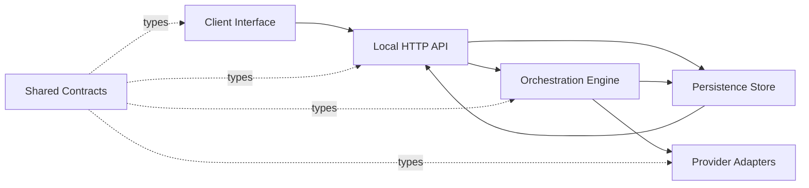

# Dependency Graph

`src/server/index.ts` wires the server objects together. `src/server/core/` contains prompt, protocol, demo, and result logic used by the engine. See [[Architecture Overview]] and the [server entry](../../src/server/index.ts).
